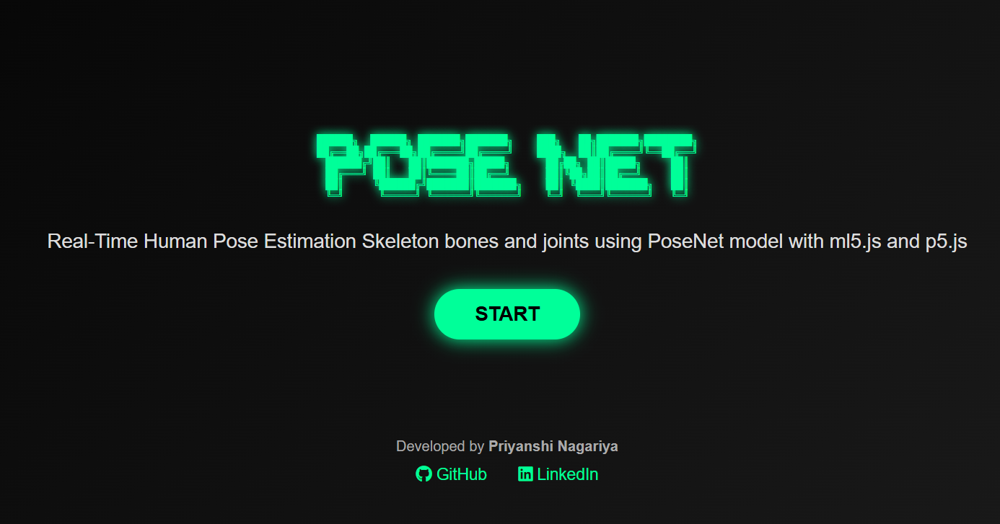

# 🚀 PoseNet - Human Pose Estimation

## About the Project
PoseNet is a real-time human pose estimation web application built using p5.js and ml5.js. It detects human body keypoints through a webcam and visualizes the pose on the screen.

## Technologies Used
- HTML5
- CSS3
- JavaScript
- ml5.js
- p5.js

##  Features
-  Real-time webcam pose detection
-  Human skeleton tracking
-  Body keypoint detection
-  Responsive design
-  Fast browser-based inference

##  Project Screenshot

## 🌐 Live Demo
https://pose-net-sage.vercel.app/

## 💻 Source Code
https://github.com/priyanshinagariya6-pixel/POSE-net
